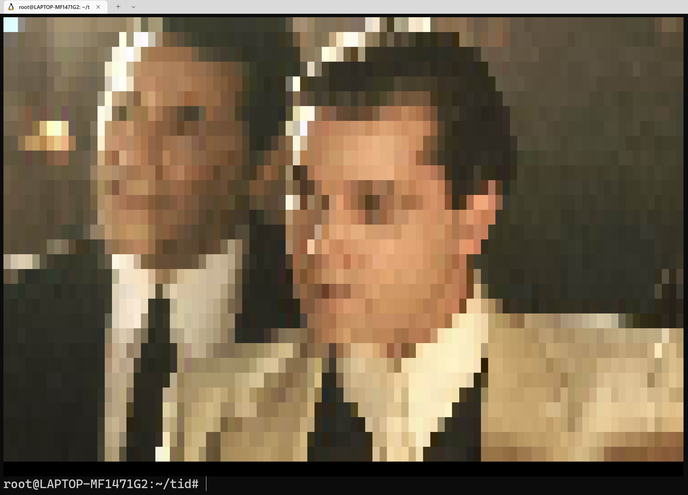

# tid
Have you ever wanted to display a completely illegible and unbelievably pixelated image in your terminal? Now you can!

tid (terminal image display) is a go library for printing images to the terminal. The package currently supports png and jpg.

## Usage
- Use with an image path as a command line argument
  - `go run main.go <path-to-image>`

## Example

The images are printed using characters in the terminal, so the resolution of the printed image depends on the size of your font, as shown below:

The source image:  

With a large font (low resolution):  

With a small font (high resolution):  

